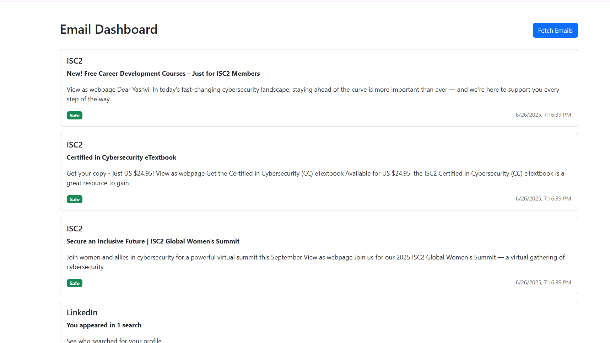

# 📧 PhishGuard — AI/ML-Based Email Phishing Detection

PhishGuard is a Node.js + Python-powered project that fetches Gmail emails and detects potential phishing using content and URL analysis with custom logic.

---

## 🚀 Features

- Fetches emails using Gmail API
- Detects phishing via:
  - Suspicious keywords
  - Malicious URLs
  - Urgency and sensitive info requests
- Classifies emails as ✅ Safe or 🚨 Phishing
- Shows reasons for detection

---

## 🛠️ Tech Stack

- **Backend:** Node.js (Express)
- **Frontend:** Vanilla HTML + Bootstrap
- **Phishing Detection Logic:** Custom Python module
- **Gmail Integration:** Google OAuth2

---

## 📁 Project Structure

root/
│
├── public/ # Frontend HTML (index.html)
├── src/
│ ├── server.js # Express server
│ ├── fetchEmails.js # Gmail fetch logic
│ ├── phishingDetector.js # Custom email analysis
│ ├── generateToken.js # Token generator
│ └── token.json # (Generated Google token, gitignored)
│
├── phishing_analyzer.py # Python phishing analyzer (if still used)
├── .env # Your Google credentials (keep private)
└── README.md

---

## 🧪 Setup & Run

### 1. 🔧 Clone the Repo

```bash
git clone https://github.com/YashviSoni04/email_phishing_analyzer.git
cd email_phishing_analyzer

2. 🧠 Set Up Python Dependencies
pip install -r requirements.txt

Then run the analyzer (if used):
python phishing_analyzer.py

3. ⚙️ Set Up Node Server
cd PhishGuard-AI-ML-based-Phishing-Detection
npm install

Start the server:
node src/server.js

4. 🌐 Visit the App
Open http://localhost:8080 in your browser.

🔐 Note
Do NOT commit client_secret.json, token.json, or .env — they contain sensitive information.

## 📸 Demo

Here’s a sample screenshot of the phishing email dashboard:




